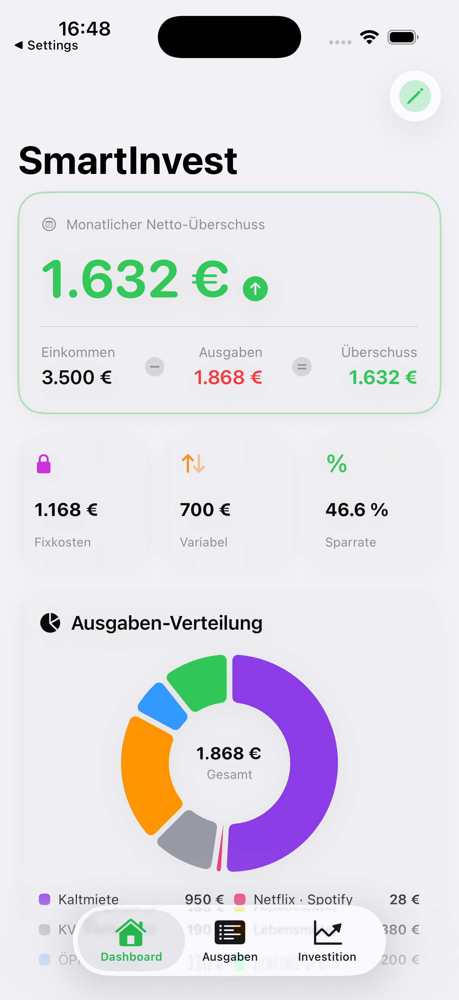
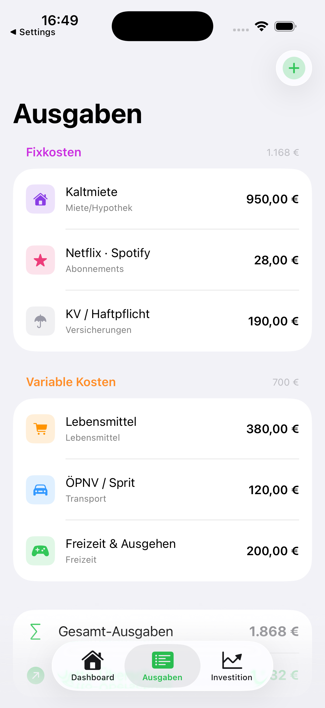
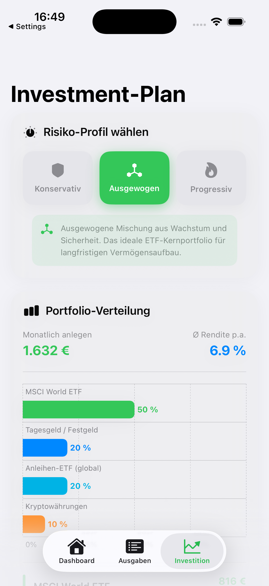
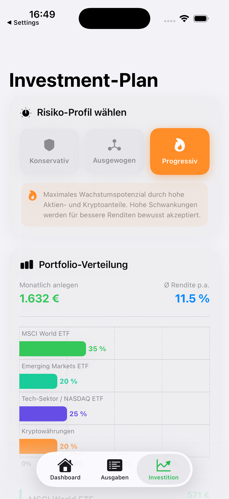
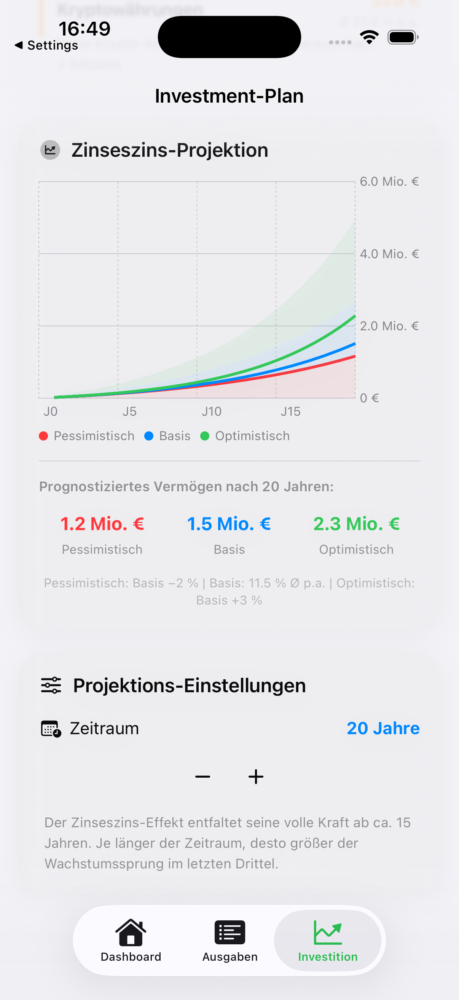

<div align="center">

# 📈 SmartInvest Planner

### Personal Finance Tracker & AI-Powered Investment Planner for iOS

[](https://swift.org)
[](https://developer.apple.com/xcode/swiftui/)
[](https://developer.apple.com/ios/)
[](https://developer.apple.com/xcode/)
[](LICENSE)

**SmartInvest Planner** hilft dir, deine monatlichen Finanzen zu überblicken und zeigt dir — basierend auf deinem persönlichen Risikoprofil — genau, wie du deinen Überschuss am cleversten investieren solltest. Mit eingebautem Zinseszins-Rechner und 3-Szenario-Projektion über bis zu 40 Jahre.

[Features](#-features) • [Screenshots](#-screenshots) •  [Architektur](#-architektur) • [Roadmap](#-roadmap)

---




</div>

---

## ✨ Features

### 💰 Finanz-Tracking
- **Monatliches Einkommen** erfassen und jederzeit anpassen
- **Fixkosten** (Miete, Abonnements, Versicherungen) und **variable Kosten** (Lebensmittel, Freizeit, Transport) separat verwalten
- **Netto-Überschuss** wird in Echtzeit berechnet — sofort sichtbar auf dem Dashboard
- **Sparquoten-Analyse** mit farbkodiertem Feedback: Kritisch / Ausbaufähig / Gut / Exzellent
- Alle Daten werden lokal via **UserDefaults** gespeichert — kein Account, kein Server, keine Cloud

### 📊 Investment-Engine
- **3 Risikoprofile** wählbar: Konservativ · Ausgewogen · Progressiv
- **Portfolio-Allokation** automatisch berechnet — mit Begründung für jede Asset-Klasse:
  - Welt-ETF (MSCI World)
  - Emerging Markets ETF
  - Tech/NASDAQ ETF
  - Anleihen-ETF (global)
  - Tagesgeld / Festgeld
  - Kryptowährungen (BTC/ETH)
- **Gewichtete Durchschnittsrendite** des Portfolios live angezeigt
- Monatlicher Investitionsbetrag direkt aus dem Netto-Überschuss abgeleitet

### 📈 Zinseszins-Projektion
- **3-Szenario-Liniendiagramm** (Pessimistisch / Basis / Optimistisch)
- Formel: `FV = PMT × [(1 + r)^n − 1] / r` — transparent im Code kommentiert
- Zeithorizont per **Stepper** einstellbar: 5 bis 40 Jahre
- Endwert-Übersicht für alle drei Szenarien auf einen Blick

### 🎨 UI / UX
- Vollständiges **Light & Dark Mode** Support
- Native **Swift Charts** — Donut-Diagramm & Balkendiagramm & Liniendiagramm
- **SF Symbols** durchgehend für ikonische Apple-Optik
- Keyboard-Toolbar mit „Fertig"-Button — keine App-Neustarts mehr nötig
- Swipe-to-Delete für Ausgaben, Inline-Editierung direkt in der Liste

---

## 📱 Screenshots


<div align="center">

| Ausgaben | Investment Plan | Investment high rist | Inverstment Balance |
|:---------:|:--------:|:----------:|:---------:|
|  |  |  |  |
| Fixkosten & variable Kosten verwalten | Medium-Risk Investment | Portfolio-Allokation & Zinseszins-Projektion | estimated Investment Balance |

</div>
---

## 🏗 Architektur

Das Projekt folgt einer klaren, dreischichtigen Struktur ohne externe Abhängigkeiten:

```
SmartInvest Planner
│
├── 📦 Model Layer
│   └── FinanceModel.swift        @Observable – zentraler State-Container
│       ├── monthlyIncome         Monatliches Nettoeinkommen
│       ├── expenses: [Expense]   Liste aller Ausgaben (Codable → UserDefaults)
│       ├── selectedRiskProfile   Gewähltes Risikoprofil
│       ├── projectionYears       Zeithorizont für die Projektion
│       └── netSurplus (computed) Das investierbare Budget
│
├── ⚙️ Service Layer
│   └── InvestmentEngine.swift    Pure-Function Service (kein State)
│       ├── allocation(for:)      Portfolio-Allokation nach Risikoprofil
│       ├── weightedReturn(for:)  Gewichtete Durchschnittsrendite
│       ├── projection(...)       Zinseszins-Formel (FV of Annuity)
│       └── multiScenario(...)    3-Szenario-Projektion
│
├── 🎨 View Layer
│   ├── ContentView               TabView – Navigation Root
│   ├── DashboardView             Hero-Card, Donut-Chart, Sparquote
│   ├── ExpensesView              Editierbare Liste, Swipe-to-Delete
│   └── InvestmentView            Risiko-Selector, Balken- & Liniendiagramm
│
├── 🧩 Shared Components
│   ├── SICard                    Universeller Karten-Container
│   ├── MiniCard                  KPI-Kachel für den Summary-Strip
│   ├── ExpenseRow                Inline-editierbare Ausgaben-Zeile
│   └── KPIBadge                  Kennzahl-Badge im Portfolio-Header
│
└── 💾 Persistenz
    └── UserDefaults              Automatisches Speichern via didSet
        ├── si_monthlyIncome
        ├── si_expenses           JSON-kodiertes [Expense]-Array
        ├── si_riskProfile
        └── si_projectionYears
```

### Investment-Logik im Detail

Die **Portfolio-Allokation** basiert auf klassischen Anlage-Prinzipien:

| Profil | Tagesgeld | Anleihen | MSCI World | Emerging | Tech | Krypto | Ø Rendite* |
|--------|:---------:|:--------:|:----------:|:--------:|:----:|:------:|:----------:|
| Konservativ | 40 % | 30 % | 25 % | — | — | 5 % | ~5,1 % |
| Ausgewogen | 20 % | 20 % | 50 % | — | — | 10 % | ~6,1 % |
| Progressiv | — | — | 35 % | 20 % | 25 % | 20 % | ~11,3 % |

> *Historische Durchschnittswerte — keine Garantie für zukünftige Renditen.

Die **Zinseszins-Projektion** verwendet die Formel für den zukünftigen Wert einer Annuität:

```
FV = PMT × [(1 + r)^n − 1] / r

PMT = monatliche Einzahlung (= Netto-Überschuss)
r   = monatlicher Zinssatz  = Jahresrendite / 12 / 100
n   = Anzahl Monate         = Jahre × 12
```

Drei Szenarien werden parallel berechnet:
- **Pessimistisch**: Basis-Rendite − 2 %
- **Basis**: Gewichtete Portfolio-Rendite
- **Optimistisch**: Basis-Rendite + 3 %

---

## 📁 Projektstruktur

```
FinancePlaner/
├── FinancePlaner/
│   ├── ContentView.swift          ← Gesamter App-Code (Single-File-Architektur)
│   ├── FinancePlanerApp.swift     ← @main Entry Point
│   └── Assets.xcassets/           ← App-Icon, Farben
├── FinancePlaner.xcodeproj/
│   └── project.pbxproj
├── screenshots/                   ← Hier Screenshots ablegen (siehe oben)
│   ├── hero.png
│   ├── 01_dashboard.png
│   ├── 02_expenses.png
│   ├── 03_investment.png
│   └── 04_darkmode.png
├── README.md
└── LICENSE
```

---

## 🚀 Roadmap

Geplante Features für zukünftige Versionen:

- [ ] **v1.1** — iCloud Sync (CloudKit) für Geräte-übergreifende Datensynchronisation
- [ ] **v1.2** — Widgets (WidgetKit) — Netto-Überschuss auf dem Homescreen
- [ ] **v1.3** — Historische Monatsübersichten & Ausgaben-Statistiken
- [ ] **v1.4** — CSV-Export der Finanzdaten
- [ ] **v1.5** — Sparziele setzen mit Fortschrittsanzeige
- [ ] **v2.0** — Live-Kursdaten via API (z.B. MSCI World ETF-Kurse)
- [ ] **v2.1** — Apple Watch Companion App
- [ ] **v2.2** — Lokalisierung (EN / DE / FR)

---

## 🧪 Technologien

| Technologie | Verwendung |
|-------------|------------|
| **SwiftUI** | Komplettes UI-Framework |
| **Swift Charts** | Donut-, Balken- & Liniendiagramme |
| **Observation Framework** | `@Observable` State-Management (iOS 17) |
| **UserDefaults** | Lokale Datenpersistenz |
| **SF Symbols 5** | Icons & Symbole |

Keine externen Abhängigkeiten (kein CocoaPods, kein SPM-Packages). Das Projekt läuft sofort nach dem Klonen.

---

## 🤝 Contributing

Beiträge sind willkommen! So gehst du vor:

1. **Fork** das Repository
2. **Feature-Branch** erstellen: `git checkout -b feature/mein-feature`
3. Änderungen **committen**: `git commit -m 'feat: mein neues Feature'`
4. Branch **pushen**: `git push origin feature/mein-feature`
5. **Pull Request** öffnen

Bitte halte dich an den bestehenden Code-Stil (Swift API Design Guidelines) und kommentiere Berechnungslogik.

---

## 📄 Lizenz

Dieses Projekt steht unter der **MIT Lizenz** — siehe [LICENSE](LICENSE) für Details.

```
MIT License

Copyright (c) 2025 [Dein Name]

Permission is hereby granted, free of charge, to any person obtaining a copy
of this software and associated documentation files (the "Software"), to deal
in the Software without restriction, including without limitation the rights
to use, copy, modify, merge, publish, distribute, sublicense, and/or sell
copies of the Software, and to permit persons to whom the Software is
furnished to do so, subject to the following conditions:

The above copyright notice and this permission notice shall be included in all
copies or substantial portions of the Software.

THE SOFTWARE IS PROVIDED "AS IS", WITHOUT WARRANTY OF ANY KIND, EXPRESS OR
IMPLIED, INCLUDING BUT NOT LIMITED TO THE WARRANTIES OF MERCHANTABILITY,
FITNESS FOR A PARTICULAR PURPOSE AND NONINFRINGEMENT.
```

---

## ⚠️ Disclaimer

> Diese App dient ausschließlich **Informations- und Bildungszwecken**. Die angezeigten Portfolio-Allokationen und Renditeprognosen stellen **keine Anlageberatung** dar. Historische Renditen sind keine Garantie für zukünftige Ergebnisse. Bitte konsultiere vor Investitionsentscheidungen einen zugelassenen Finanzberater.

---

<div align="center">

Made with ❤️ by Ilya Jafari

</div>
